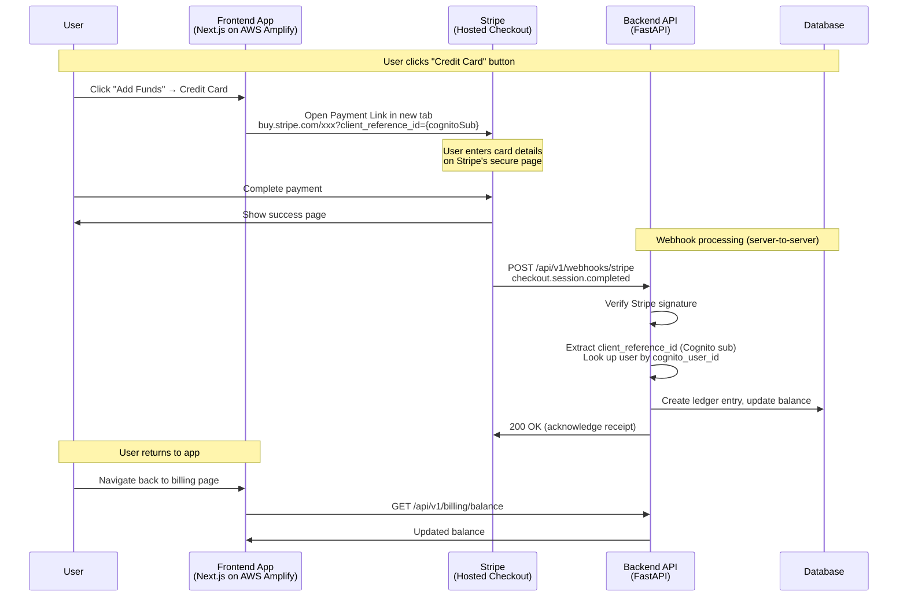
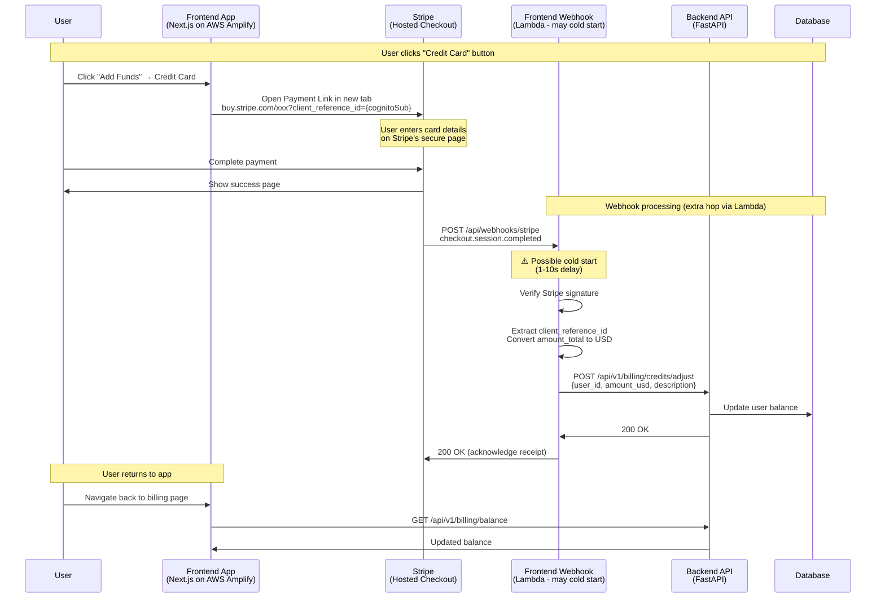

# Stripe Payment Integration Flow

**Last Updated:** January 23, 2026  
**Status:** Using Payment Links with Direct Backend Webhook

---

## Overview

This document explains the Stripe payment integration for the Morpheus Marketplace. We use **Stripe Payment Links** which provide:

- **No card data handling** - Users pay on Stripe's secure hosted page
- **Simplified PCI compliance** - SAQ A (simplest questionnaire)
- **Reduced attack surface** - Fewer API routes, less code to maintain

---

## Architecture Options

### Option A: Direct Backend Webhook (Recommended)



**Advantages:**
- Single hop (Stripe → Backend)
- Always-on FastAPI server (no cold starts)
- Faster webhook processing
- Simpler architecture

### Option B: Frontend Webhook Bridge (Legacy)



**When to use:**
- If Backend webhook doesn't support your payment method
- If you need frontend-specific processing logic

---

## AWS Amplify vs Vercel Deployment Considerations

Since the frontend is deployed on **AWS Amplify** (not Vercel), there are important differences for webhook handling:

### Comparison Table

| Aspect | Vercel | AWS Amplify |
|--------|--------|-------------|
| **API Routes** | Native, optimized for Next.js | Converted to Lambda functions |
| **Cold Starts** | Minimal (~50-200ms) | Can be 1-10+ seconds |
| **Default Timeout** | 10s (Hobby), 60s (Pro) | 10s (configurable) |
| **Streaming** | Native support | Requires OpenNext config |
| **Always Warm** | No (serverless) | No (serverless) |

### Webhook Reliability on AWS Amplify

**Concern:** Lambda cold starts can delay webhook processing.

**Mitigations:**
1. **Stripe retries** - Stripe retries failed webhooks for up to 3 days
2. **Lightweight handlers** - Node.js cold starts are typically 200ms-2s
3. **Direct Backend preferred** - FastAPI is always running, no cold starts

### Recommendation

**Use Direct Backend Webhook** when deploying frontend on AWS Amplify because:

| Frontend Webhook (Amplify) | Backend Webhook (FastAPI) |
|---------------------------|---------------------------|
| ❌ Cold start delays possible | ✅ Always warm |
| ❌ Extra hop (Amplify → Backend) | ✅ Direct processing |
| ❌ Lambda timeout risks | ✅ No timeout concerns |
| ❌ More points of failure | ✅ Simpler architecture |


## AWS Amplify Deployment Note

The frontend is deployed on **AWS Amplify**, where API routes run as Lambda functions with potential cold starts (1-10s). This is why **Option A (Direct Backend)** is recommended - the FastAPI backend is always running with no cold start delays.

If using Option B, Stripe's retry mechanism (up to 3 days) mitigates occasional cold start timeouts.

---

## User Identification

The system supports multiple user identification methods depending on payment source:

| Payment Source | Identifier Location | Identifier Type | Lookup Method |
|----------------|---------------------|-----------------|---------------|
| Checkout Session (API) | `session.metadata.user_id` | Database ID (integer) | `get_user_by_id()` |
| Payment Link | `session.client_reference_id` | Cognito sub (UUID) | `get_user_by_cognito_id()` |

### How It Works

1. **Frontend** passes `user.sub` (Cognito UUID) as `client_reference_id`:
   ```typescript
   const url = `https://buy.stripe.com/xxx?client_reference_id=${user.sub}`;
   ```

2. **Backend** webhook receives the session and looks up user:
   ```python
   # First tries metadata.user_id (database ID)
   # Then tries client_reference_id (Cognito sub)
   user = await user_crud.get_user_by_cognito_id(db, client_reference_id)
   ```

---

## Data Flow Details

### Payment Link URL Structure

```
https://buy.stripe.com/{payment_link_id}?client_reference_id={cognitoSub}
```

**Example:**
```
https://buy.stripe.com/test_9B6bJ0eU08TG6Pi4EIgnK00?client_reference_id=abc123-def456-789
```

### Webhook Payload (checkout.session.completed)

```json
{
  "id": "evt_xxx",
  "type": "checkout.session.completed",
  "data": {
    "object": {
      "id": "cs_xxx",
      "client_reference_id": "abc123-def456-789",
      "amount_total": 2500,
      "currency": "usd",
      "payment_status": "paid",
      "metadata": {}
    }
  }
}
```

### Backend Webhook Processing

```python
# In stripe_webhook_service.py
session = event.data.object
client_reference_id = getattr(session, 'client_reference_id', None)

# Look up user by Cognito ID
user = await user_crud.get_user_by_cognito_id(db, client_reference_id)

# Convert cents to USD
amount_usd = Decimal(session.amount_total) / 100

# Create ledger entry
await credits_crud.create_ledger_entry(
    user_id=user.id,
    amount_paid=amount_usd,
    description="Stripe payment - Payment Link",
    ...
)
```

---

## Endpoints Reference

### Backend API (Marketplace API)

| Endpoint | Method | Purpose | Auth |
|----------|--------|---------|------|
| `/api/v1/billing/balance` | GET | Get user balance | Bearer Token |
| `/api/v1/billing/credits/adjust` | POST | Credit/debit user account | Admin Secret |
| `/api/v1/billing/usage` | GET | Get usage entries | Bearer Token |
| `/api/v1/webhooks/stripe` | POST | Process Stripe webhooks | Signature |

### Frontend (Optional Bridge)

| Endpoint | Method | Purpose | Status |
|----------|--------|---------|--------|
| `/api/webhooks/stripe` | POST | Bridge to Backend (if needed) | Optional |

---

## Environment Variables

### Backend (Marketplace API)

```bash
# Stripe
STRIPE_SECRET_KEY=sk_xxx
STRIPE_WEBHOOK_SECRET=whsec_xxx
```

### Frontend (if using webhook bridge)

```bash
# Stripe (only if using frontend webhook)
STRIPE_SECRET_KEY=sk_test_xxx
STRIPE_WEBHOOK_SECRET=whsec_xxx

# Backend connection
NEXT_PUBLIC_API_BASE_URL=https://api.mor.org
ADMIN_API_SECRET=xxx
```

---

## Stripe Dashboard Configuration

### Payment Link Setup

1. Go to [Stripe Dashboard](https://dashboard.stripe.com) → Products → Payment Links
2. Create a new Payment Link with your pricing
3. Configure **After payment** settings:
   - Success URL (live): `https://app.mor.org/billing?payment=success`
   - Success URL (testing): `https://app.dev.mor.org/billing?payment=success`

### Webhook Setup (Direct Backend)

1. Go to Stripe Dashboard → Developers → Webhooks
2. Add endpoint: `https://api.mor.org/api/v1/webhooks/stripe`, `https://api.dev.mor.org/api/v1/webhooks/stripe`
3. Select events: `checkout.session.completed`
4. Copy the **Signing secret** to `STRIPE_WEBHOOK_SECRET`

---

## Testing

### Test Payment Link

```bash
# Open in browser (use your Cognito sub as client_reference_id)
https://buy.stripe.com/test_xxx?client_reference_id=your-cognito-sub-here
```

### Test Webhook Locally

```bash
# Install Stripe CLI
brew install stripe/stripe-cli/stripe

# Forward webhooks to local backend
stripe listen --forward-to localhost:8000/api/v1/webhooks/stripe

# Trigger a test event
stripe trigger checkout.session.completed
```

### Test Cards

| Card Number | Result |
|-------------|--------|
| 4242 4242 4242 4242 | Success |
| 4000 0000 0000 0002 | Declined |
| 4000 0025 0000 3155 | Requires 3D Secure |

---

## Troubleshooting

| Issue | Cause | Solution |
|-------|-------|----------|
| User not credited | Missing `client_reference_id` | Ensure URL includes `?client_reference_id={cognitoSub}` |
| User not found | Cognito sub not in database | User must have logged in at least once to create DB record |
| Webhook 400 | Invalid signature | Check `STRIPE_WEBHOOK_SECRET` matches dashboard |
| Webhook 500 | Backend error | Check backend logs for details |
| Cold start timeout | AWS Amplify Lambda | Use direct backend webhook instead |

---

## Security Considerations

### Webhook Security

1. **Signature Verification** - Every webhook is verified using HMAC-SHA256
2. **Idempotency** - Event IDs prevent duplicate processing
3. **Server-to-Server** - Webhooks bypass user's browser entirely

### PCI Compliance

Using Payment Links means:
- Card data **never** touches our servers
- Stripe handles all sensitive data
- SAQ A compliance (self-assessment questionnaire)

---

## Related Documentation

- [Stripe Payment Links](https://stripe.com/docs/payment-links)
- [Stripe Webhooks](https://stripe.com/docs/webhooks)
- [Stripe Testing](https://stripe.com/docs/testing)
- [AWS Amplify Next.js](https://docs.amplify.aws/guides/hosting/nextjs/)
